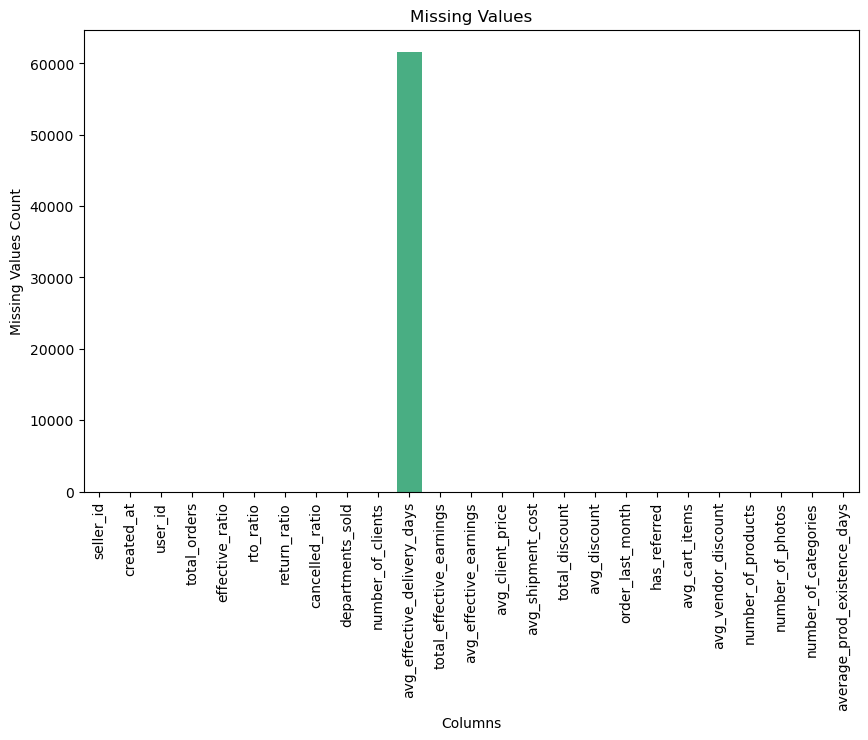
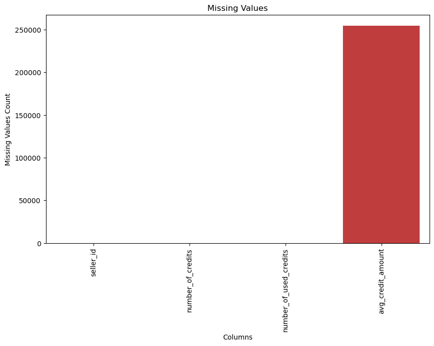
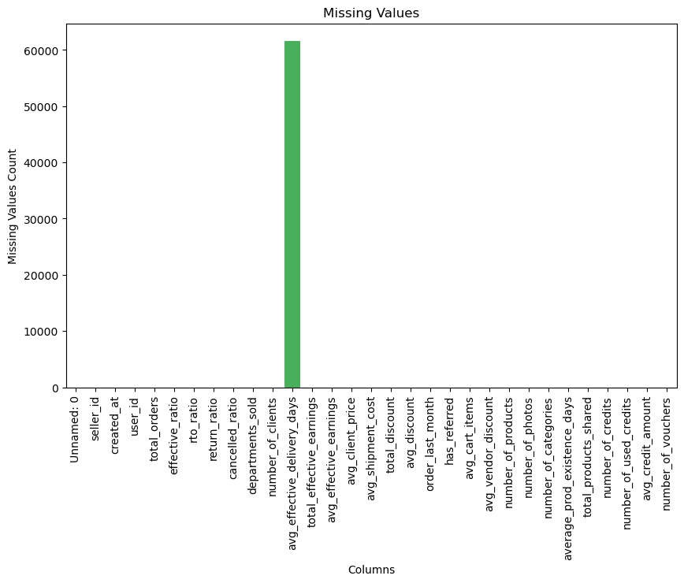

## Data Wrangling

This notebook consists of the data consolidation and cleaning of the model. 
It includes a series of joins between the sellers considered for the first iteration and different variables grouped by the sellerID from CSVs

**DF Structure**

|  Name |Comments   |
|---|---|
| DFsellers1 |original sellers DF |
| DFsellers2 | Include the threshold for the target variable (jun-2021)   |
| DFsellers3| Include the orders information and dropped the sellers without orders   |
| DFsellers4| Include the target variable   |
| DFsellers5| Include referrals information   |
| DFsellers6| Include products and categories information   |
| DFsellers7| Include financial information of credits and vouchers   |

DFsellers7 ended up with 263,265 and 32 columns (3 need to be dropped based). The columns can be labeled as transactional, operational and behavioural information.


```python
# Importing the libraries
import numpy as np
import pandas as pd
import matplotlib.pyplot as plt
import seaborn as sns
import scipy as scipy
from scipy import stats
from scipy.stats import chi2_contingency
import statsmodels.api as sm
from statsmodels.stats.outliers_influence import variance_inflation_factor
```


```python
import plotly.express as px
from plotly.subplots import make_subplots
import plotly.graph_objects as go
import plotly.express as px
```

### Sellers:
- The DF had 1,723,856, but I established a treshold of sellers with creation date >= june 2021. Prior to that period there was a national strike that affected the conditions, and also, since it is a early stage company with many iterations in different areas changed the sellers' experience.
- Additional sellers were dropped, for example, the ones banned from the business model and others labeld as ex-pioneer, which had a very different earnings schema and would add noice to the model
- Additionally, non relevan columns such as business model or referred_by_id were droped
- The last seller DF has 1,598,970 sellers


```python
dfsellers1 = pd.read_csv("../Data/seller.csv")
```


```python
dfsellers1.head(5)
```


<div>
<style scoped>
    .dataframe tbody tr th:only-of-type {
        vertical-align: middle;
    }

    .dataframe tbody tr th {
        vertical-align: top;
    }

    .dataframe thead th {
        text-align: right;
    }
</style>
<table border="1" class="dataframe">
  <thead>
    <tr style="text-align: right;">
      <th></th>
      <th>id</th>
      <th>created_at</th>
      <th>referred_by_id</th>
      <th>user_id</th>
      <th>banned_elenas</th>
      <th>ex_pioneer</th>
      <th>business_model</th>
    </tr>
  </thead>
  <tbody>
    <tr>
      <th>0</th>
      <td>11391541</td>
      <td>2022-09-23 00:10:33.003499+02</td>
      <td>NaN</td>
      <td>11419818</td>
      <td>False</td>
      <td>False</td>
      <td>DEFAULT</td>
    </tr>
    <tr>
      <th>1</th>
      <td>11534279</td>
      <td>2022-11-21 00:36:52.063471+01</td>
      <td>NaN</td>
      <td>11562762</td>
      <td>False</td>
      <td>False</td>
      <td>DEFAULT</td>
    </tr>
    <tr>
      <th>2</th>
      <td>11543049</td>
      <td>2022-11-25 13:52:46.429364+01</td>
      <td>NaN</td>
      <td>11571595</td>
      <td>False</td>
      <td>False</td>
      <td>DEFAULT</td>
    </tr>
    <tr>
      <th>3</th>
      <td>11554558</td>
      <td>2022-12-01 06:30:08.778874+01</td>
      <td>NaN</td>
      <td>11583127</td>
      <td>False</td>
      <td>False</td>
      <td>DEFAULT</td>
    </tr>
    <tr>
      <th>4</th>
      <td>11567548</td>
      <td>2022-12-07 15:24:24.01911+01</td>
      <td>NaN</td>
      <td>11596129</td>
      <td>False</td>
      <td>False</td>
      <td>DEFAULT</td>
    </tr>
  </tbody>
</table>
</div>


```python
# Originally, there are 1.723.856 sellers
dfsellers1.count()
```


    id                1723856
    created_at        1723856
    referred_by_id          0
    user_id           1723856
    banned_elenas     1723856
    ex_pioneer        1723856
    business_model    1723856
    dtype: int64


### Creation date & threshold


```python
dfsellers1['created_at'].dtype
```


    dtype('O')


```python
dfsellers1.dtypes
```


    id                  int64
    created_at         object
    referred_by_id    float64
    user_id             int64
    banned_elenas        bool
    ex_pioneer           bool
    business_model     object
    dtype: object


```python
#convert the 'created_at' column from a string to a datetime object with timezone information.
dfsellers1['created_at'] = pd.to_datetime(dfsellers1['created_at'], utc=True)
#convert the datetime objects to strings in the desired day format ('YYYY-MM-DD').
dfsellers1['created_at'] = dfsellers1['created_at'].dt.strftime('%Y-%m-%d')

#Convert it back to datetime 
dfsellers1['created_at'] = pd.to_datetime(dfsellers1['created_at'])


```


```python
dfsellers1.head(5)
dfsellers1.dtypes
```


    id                         int64
    created_at        datetime64[ns]
    referred_by_id           float64
    user_id                    int64
    banned_elenas               bool
    ex_pioneer                  bool
    business_model            object
    dtype: object


dfsellers 1: 1.723.856 sellers, created as string, 0 referred by id


```python
threshold_date = pd.to_datetime('2021-06-01')
dfsellers2 = dfsellers1[dfsellers1['created_at'] >= threshold_date]
```


```python
dfsellers2.count()
```


    id                1598970
    created_at        1598970
    referred_by_id          0
    user_id           1598970
    banned_elenas     1598970
    ex_pioneer        1598970
    business_model    1598970
    dtype: int64


```python
#Banned review:
dfsellers2["banned_elenas"].value_counts()


```


    False    1598825
    True         145
    Name: banned_elenas, dtype: int64


```python
# Deleting the banned sellers and resetting the index
dfsellers2 = dfsellers2[dfsellers2["banned_elenas"] != True].reset_index(drop=True)

```


```python
#Referrals elimination
dfsellers2.drop("referred_by_id", axis=1, inplace=True)

```


```python
#business model review:
dfsellers2["business_model"].value_counts()
print("All the sellers have the same business model, the column will be eliminated")
dfsellers2.drop("business_model", axis=1, inplace=True)
```

    All the sellers have the same business model, the column will be eliminated


```python
dfsellers2.count()
```


    id               1598825
    created_at       1598825
    user_id          1598825
    banned_elenas    1598825
    ex_pioneer       1598825
    dtype: int64


```python
# ex pioneer review:
dfsellers2["ex_pioneer"].value_counts()
f"All the values of the ex_pioneer are the same. The column will be dropped"

dfsellers2.drop("ex_pioneer", axis=1, inplace=True)
```


```python
dfsellers2.head()
```


<div>
<style scoped>
    .dataframe tbody tr th:only-of-type {
        vertical-align: middle;
    }

    .dataframe tbody tr th {
        vertical-align: top;
    }

    .dataframe thead th {
        text-align: right;
    }
</style>
<table border="1" class="dataframe">
  <thead>
    <tr style="text-align: right;">
      <th></th>
      <th>id</th>
      <th>created_at</th>
      <th>user_id</th>
      <th>banned_elenas</th>
    </tr>
  </thead>
  <tbody>
    <tr>
      <th>0</th>
      <td>11391541</td>
      <td>2022-09-22</td>
      <td>11419818</td>
      <td>False</td>
    </tr>
    <tr>
      <th>1</th>
      <td>11534279</td>
      <td>2022-11-20</td>
      <td>11562762</td>
      <td>False</td>
    </tr>
    <tr>
      <th>2</th>
      <td>11543049</td>
      <td>2022-11-25</td>
      <td>11571595</td>
      <td>False</td>
    </tr>
    <tr>
      <th>3</th>
      <td>11554558</td>
      <td>2022-12-01</td>
      <td>11583127</td>
      <td>False</td>
    </tr>
    <tr>
      <th>4</th>
      <td>11567548</td>
      <td>2022-12-07</td>
      <td>11596129</td>
      <td>False</td>
    </tr>
  </tbody>
</table>
</div>


```python
def nan_rev(df):

    """
    Calculates and displays information about missing values in a DataFrame.

    Parameters:
    - df (pandas.DataFrame): The input DataFrame.

    Returns:
    - percentage_nan (pandas.Series): The percentage of missing values for each column.
    - missing_values_distribution (pandas.Series): The distribution of missing values for each column.
    """
    # NaN values
    total_nan = df.isna().sum().sum()
    print(f"{df} has {total_nan} NaN values")

    percentage_nan = df.isna().sum() / df.shape[0] * 100.0
    print("The percentage of missing values for each column is:")
    print(percentage_nan)

    missing_values_distribution = df.isna().sum()
    print("Missing values distribution:")
    print(missing_values_distribution)

    return  percentage_nan, missing_values_distribution

print(nan_rev(dfsellers2))


```

                   id created_at   user_id  banned_elenas
    0        11391541 2022-09-22  11419818          False
    1        11534279 2022-11-20  11562762          False
    2        11543049 2022-11-25  11571595          False
    3        11554558 2022-12-01  11583127          False
    4        11567548 2022-12-07  11596129          False
    ...           ...        ...       ...            ...
    1598820  11391536 2022-09-22  11419813          False
    1598821  11391537 2022-09-22  11419814          False
    1598822  11391538 2022-09-22  11419815          False
    1598823  11391539 2022-09-22  11419816          False
    1598824  11391540 2022-09-22  11419817          False
    
    [1598825 rows x 4 columns] has 0 NaN values
    The percentage of missing values for each column is:
    id               0.0
    created_at       0.0
    user_id          0.0
    banned_elenas    0.0
    dtype: float64
    Missing values distribution:
    id               0
    created_at       0
    user_id          0
    banned_elenas    0
    dtype: int64
    (id               0.0
    created_at       0.0
    user_id          0.0
    banned_elenas    0.0
    dtype: float64, id               0
    created_at       0
    user_id          0
    banned_elenas    0
    dtype: int64)


```python
def nan_vis(df):
    """
    Visualizes missing values in a DataFrame.

    Parameters:
    - df (pandas.DataFrame): The input DataFrame.

    Returns:
    - str: A message indicating if there are any missing values or not.
    - If there are missing values, returns a bar graph with the missing values.
    """

    # Visualize missing values
    if df.isna().sum().sum() == 0:
        return "There are no missing values"
    else:
        plt.figure(figsize=(10, 6))
        plt.title("Missing Values")
        ax = sns.barplot(x=df.columns, y=df.isna().sum())
        ax.set_xticklabels(ax.get_xticklabels(), rotation=90)
        plt.xlabel("Columns")
        plt.ylabel("Missing Values Count")
        plt.show()

print(nan_vis(dfsellers2))
```

    There are no missing values


```python
dfsellers2.head(5)

```


<div>
<style scoped>
    .dataframe tbody tr th:only-of-type {
        vertical-align: middle;
    }

    .dataframe tbody tr th {
        vertical-align: top;
    }

    .dataframe thead th {
        text-align: right;
    }
</style>
<table border="1" class="dataframe">
  <thead>
    <tr style="text-align: right;">
      <th></th>
      <th>id</th>
      <th>created_at</th>
      <th>user_id</th>
      <th>banned_elenas</th>
    </tr>
  </thead>
  <tbody>
    <tr>
      <th>0</th>
      <td>11391541</td>
      <td>2022-09-22</td>
      <td>11419818</td>
      <td>False</td>
    </tr>
    <tr>
      <th>1</th>
      <td>11534279</td>
      <td>2022-11-20</td>
      <td>11562762</td>
      <td>False</td>
    </tr>
    <tr>
      <th>2</th>
      <td>11543049</td>
      <td>2022-11-25</td>
      <td>11571595</td>
      <td>False</td>
    </tr>
    <tr>
      <th>3</th>
      <td>11554558</td>
      <td>2022-12-01</td>
      <td>11583127</td>
      <td>False</td>
    </tr>
    <tr>
      <th>4</th>
      <td>11567548</td>
      <td>2022-12-07</td>
      <td>11596129</td>
      <td>False</td>
    </tr>
  </tbody>
</table>
</div>


```python
#rename id to seller_id
dfsellers2.rename(columns={'id': 'seller_id'}, inplace=True)
```

### DF Orders

- I droped the sellers that have no placed orders, since they are not relevant for the business question. The number of sellers for the analysis is 279059 sellers
- The added columns are aggregates of different metric for each seller. Depending of the variable relevance during the modeling stage, some variables could be desaggregated.
- There are 67.5K NaN values of average effective delivery days. These come from sellers without effective orders, but the will be treated later.
- Those sellers also had NaN values for columns such as total earnings or average earnings. Those missing values were replaced by 0


```python
dforders1 = pd.read_csv("../Data/total_orders_agg.csv")
```


```python
dforders1.columns
```


    Index(['seller_id', 'total_orders', 'effective_ratio', 'rto_ratio',
           'return_ratio', 'cancelled_ratio', 'departments_sold',
           'number_of_clients', 'avg_effective_delivery_days',
           'total_effective_earnings', 'avg_effective_earnings',
           'avg_client_price', 'avg_shipment_cost', 'total_discount',
           'avg_discount'],
          dtype='object')


```python
def basic_info(df):
    """
    Provides basic information about a DataFrame.

    Parameters:
    - df (pandas.DataFrame): The input DataFrame.

    Returns:
    - list: A tuple containing lists of categorical columns and numerical columns, respectively.
    """
    print(f"The shape of the df is {df.shape}")
    print(f"Number of datapoints: {df.count()}")
    print("")
    print("Data types:")
    print(df.dtypes)
    print(f"there are {df.duplicated().sum()} duplicate values")
    print(f"there are {df.isna().sum().sum()} NaN values")
    cat_cols = df.select_dtypes(include=["object"]).columns.to_list()
    num_cols = df.select_dtypes(exclude=["object"]).columns.to_list()
    return df.head(5)


print(basic_info(dforders1))

```

    The shape of the df is (279059, 15)
    Number of datapoints: seller_id                      279059
    total_orders                   279059
    effective_ratio                279059
    rto_ratio                      279059
    return_ratio                   279059
    cancelled_ratio                279059
    departments_sold               279059
    number_of_clients              279059
    avg_effective_delivery_days    211476
    total_effective_earnings       211483
    avg_effective_earnings         211483
    avg_client_price               279059
    avg_shipment_cost              279059
    total_discount                 279059
    avg_discount                   279059
    dtype: int64
    
    Data types:
    seller_id                        int64
    total_orders                     int64
    effective_ratio                float64
    rto_ratio                      float64
    return_ratio                   float64
    cancelled_ratio                float64
    departments_sold                 int64
    number_of_clients                int64
    avg_effective_delivery_days    float64
    total_effective_earnings       float64
    avg_effective_earnings         float64
    avg_client_price               float64
    avg_shipment_cost              float64
    total_discount                 float64
    avg_discount                   float64
    dtype: object
    there are 0 duplicate values
    there are 202735 NaN values
       seller_id  total_orders  effective_ratio  rto_ratio  return_ratio  \
    0          3            47         0.851064   0.000000      0.000000   
    1          6             2         0.000000   1.000000      0.000000   
    2         20             8         0.500000   0.125000      0.000000   
    3         31           338         0.890533   0.000000      0.014793   
    4         46            43         0.720930   0.116279      0.046512   
    
       cancelled_ratio  departments_sold  number_of_clients  \
    0         0.148936                 5                  8   
    1         0.000000                 2                  2   
    2         0.375000                 3                  5   
    3         0.082840                 4                 30   
    4         0.116279                 2                 11   
    
       avg_effective_delivery_days  total_effective_earnings  \
    0                     6.300000                  188965.0   
    1                          NaN                       NaN   
    2                     3.000000                  162100.0   
    3                     2.392027                36728379.0   
    4                     3.451613                  227550.0   
    
       avg_effective_earnings  avg_client_price  avg_shipment_cost  \
    0             4724.125000     202888.808511        7755.319149   
    1                     NaN     125094.000000        6500.000000   
    2            40525.000000     142312.500000        5000.000000   
    3           122021.192691     290817.073964        5253.254438   
    4             7340.322581      62044.279070        4000.000000   
    
       total_discount  avg_discount  
    0             0.0           0.0  
    1             0.0           0.0  
    2             0.0           0.0  
    3             0.0           0.0  
    4             0.0           0.0  


```python
dforders1.head(10).round(2)
```


<div>
<style scoped>
    .dataframe tbody tr th:only-of-type {
        vertical-align: middle;
    }

    .dataframe tbody tr th {
        vertical-align: top;
    }

    .dataframe thead th {
        text-align: right;
    }
</style>
<table border="1" class="dataframe">
  <thead>
    <tr style="text-align: right;">
      <th></th>
      <th>seller_id</th>
      <th>total_orders</th>
      <th>effective_ratio</th>
      <th>rto_ratio</th>
      <th>return_ratio</th>
      <th>cancelled_ratio</th>
      <th>departments_sold</th>
      <th>number_of_clients</th>
      <th>avg_effective_delivery_days</th>
      <th>total_effective_earnings</th>
      <th>avg_effective_earnings</th>
      <th>avg_client_price</th>
      <th>avg_shipment_cost</th>
      <th>total_discount</th>
      <th>avg_discount</th>
    </tr>
  </thead>
  <tbody>
    <tr>
      <th>0</th>
      <td>3</td>
      <td>47</td>
      <td>0.85</td>
      <td>0.00</td>
      <td>0.00</td>
      <td>0.15</td>
      <td>5</td>
      <td>8</td>
      <td>6.30</td>
      <td>188965.0</td>
      <td>4724.12</td>
      <td>202888.81</td>
      <td>7755.32</td>
      <td>0.0</td>
      <td>0.0</td>
    </tr>
    <tr>
      <th>1</th>
      <td>6</td>
      <td>2</td>
      <td>0.00</td>
      <td>1.00</td>
      <td>0.00</td>
      <td>0.00</td>
      <td>2</td>
      <td>2</td>
      <td>NaN</td>
      <td>NaN</td>
      <td>NaN</td>
      <td>125094.00</td>
      <td>6500.00</td>
      <td>0.0</td>
      <td>0.0</td>
    </tr>
    <tr>
      <th>2</th>
      <td>20</td>
      <td>8</td>
      <td>0.50</td>
      <td>0.12</td>
      <td>0.00</td>
      <td>0.38</td>
      <td>3</td>
      <td>5</td>
      <td>3.00</td>
      <td>162100.0</td>
      <td>40525.00</td>
      <td>142312.50</td>
      <td>5000.00</td>
      <td>0.0</td>
      <td>0.0</td>
    </tr>
    <tr>
      <th>3</th>
      <td>31</td>
      <td>338</td>
      <td>0.89</td>
      <td>0.00</td>
      <td>0.01</td>
      <td>0.08</td>
      <td>4</td>
      <td>30</td>
      <td>2.39</td>
      <td>36728379.0</td>
      <td>122021.19</td>
      <td>290817.07</td>
      <td>5253.25</td>
      <td>0.0</td>
      <td>0.0</td>
    </tr>
    <tr>
      <th>4</th>
      <td>46</td>
      <td>43</td>
      <td>0.72</td>
      <td>0.12</td>
      <td>0.05</td>
      <td>0.12</td>
      <td>2</td>
      <td>11</td>
      <td>3.45</td>
      <td>227550.0</td>
      <td>7340.32</td>
      <td>62044.28</td>
      <td>4000.00</td>
      <td>0.0</td>
      <td>0.0</td>
    </tr>
    <tr>
      <th>5</th>
      <td>63</td>
      <td>20</td>
      <td>0.85</td>
      <td>0.05</td>
      <td>0.10</td>
      <td>0.00</td>
      <td>1</td>
      <td>11</td>
      <td>2.41</td>
      <td>90241.0</td>
      <td>5308.29</td>
      <td>50271.05</td>
      <td>4800.00</td>
      <td>0.0</td>
      <td>0.0</td>
    </tr>
    <tr>
      <th>6</th>
      <td>68</td>
      <td>18</td>
      <td>0.67</td>
      <td>0.17</td>
      <td>0.00</td>
      <td>0.17</td>
      <td>5</td>
      <td>6</td>
      <td>8.42</td>
      <td>97934.0</td>
      <td>8161.17</td>
      <td>82436.67</td>
      <td>6444.44</td>
      <td>0.0</td>
      <td>0.0</td>
    </tr>
    <tr>
      <th>7</th>
      <td>86</td>
      <td>26</td>
      <td>0.85</td>
      <td>0.04</td>
      <td>0.04</td>
      <td>0.08</td>
      <td>1</td>
      <td>8</td>
      <td>2.73</td>
      <td>209665.0</td>
      <td>9530.23</td>
      <td>72772.38</td>
      <td>4384.62</td>
      <td>0.0</td>
      <td>0.0</td>
    </tr>
    <tr>
      <th>8</th>
      <td>113</td>
      <td>2</td>
      <td>0.00</td>
      <td>0.00</td>
      <td>0.00</td>
      <td>1.00</td>
      <td>1</td>
      <td>1</td>
      <td>NaN</td>
      <td>NaN</td>
      <td>NaN</td>
      <td>35989.00</td>
      <td>6000.00</td>
      <td>0.0</td>
      <td>0.0</td>
    </tr>
    <tr>
      <th>9</th>
      <td>114</td>
      <td>25</td>
      <td>0.60</td>
      <td>0.04</td>
      <td>0.00</td>
      <td>0.00</td>
      <td>3</td>
      <td>9</td>
      <td>3.73</td>
      <td>98750.0</td>
      <td>6583.33</td>
      <td>50406.08</td>
      <td>6920.00</td>
      <td>0.0</td>
      <td>0.0</td>
    </tr>
  </tbody>
</table>
</div>


```python
nan_rev(dforders1)
```

            seller_id  total_orders  effective_ratio  rto_ratio  return_ratio  \
    0               3            47         0.851064   0.000000      0.000000   
    1               6             2         0.000000   1.000000      0.000000   
    2              20             8         0.500000   0.125000      0.000000   
    3              31           338         0.890533   0.000000      0.014793   
    4              46            43         0.720930   0.116279      0.046512   
    ...           ...           ...              ...        ...           ...   
    279054   11886487             1         1.000000   0.000000      0.000000   
    279055   11886505             1         1.000000   0.000000      0.000000   
    279056   11886533             1         1.000000   0.000000      0.000000   
    279057   11886542             2         1.000000   0.000000      0.000000   
    279058   11886576             1         1.000000   0.000000      0.000000   
    
            cancelled_ratio  departments_sold  number_of_clients  \
    0              0.148936                 5                  8   
    1              0.000000                 2                  2   
    2              0.375000                 3                  5   
    3              0.082840                 4                 30   
    4              0.116279                 2                 11   
    ...                 ...               ...                ...   
    279054         0.000000                 1                  1   
    279055         0.000000                 1                  1   
    279056         0.000000                 1                  1   
    279057         0.000000                 1                  1   
    279058         0.000000                 1                  1   
    
            avg_effective_delivery_days  total_effective_earnings  \
    0                          6.300000                  188965.0   
    1                               NaN                       NaN   
    2                          3.000000                  162100.0   
    3                          2.392027                36728379.0   
    4                          3.451613                  227550.0   
    ...                             ...                       ...   
    279054                     0.000000                    2708.0   
    279055                     0.000000                   19965.0   
    279056                     0.000000                   11802.0   
    279057                     0.000000                   13811.0   
    279058                     0.000000                   15600.0   
    
            avg_effective_earnings  avg_client_price  avg_shipment_cost  \
    0                  4724.125000     202888.808511        7755.319149   
    1                          NaN     125094.000000        6500.000000   
    2                 40525.000000     142312.500000        5000.000000   
    3                122021.192691     290817.073964        5253.254438   
    4                  7340.322581      62044.279070        4000.000000   
    ...                        ...               ...                ...   
    279054             2708.000000      12900.000000           0.000000   
    279055            19965.000000     241900.000000        7500.000000   
    279056            11802.000000     113600.000000       14000.000000   
    279057             6905.500000      54800.000000       11000.000000   
    279058            15600.000000     158000.000000           0.000000   
    
            total_discount  avg_discount  
    0                  0.0           0.0  
    1                  0.0           0.0  
    2                  0.0           0.0  
    3                  0.0           0.0  
    4                  0.0           0.0  
    ...                ...           ...  
    279054             0.0           0.0  
    279055             0.0           0.0  
    279056             0.0           0.0  
    279057             0.0           0.0  
    279058             0.0           0.0  
    
    [279059 rows x 15 columns] has 202735 NaN values
    The percentage of missing values for each column is:
    seller_id                       0.000000
    total_orders                    0.000000
    effective_ratio                 0.000000
    rto_ratio                       0.000000
    return_ratio                    0.000000
    cancelled_ratio                 0.000000
    departments_sold                0.000000
    number_of_clients               0.000000
    avg_effective_delivery_days    24.218176
    total_effective_earnings       24.215668
    avg_effective_earnings         24.215668
    avg_client_price                0.000000
    avg_shipment_cost               0.000000
    total_discount                  0.000000
    avg_discount                    0.000000
    dtype: float64
    Missing values distribution:
    seller_id                          0
    total_orders                       0
    effective_ratio                    0
    rto_ratio                          0
    return_ratio                       0
    cancelled_ratio                    0
    departments_sold                   0
    number_of_clients                  0
    avg_effective_delivery_days    67583
    total_effective_earnings       67576
    avg_effective_earnings         67576
    avg_client_price                   0
    avg_shipment_cost                  0
    total_discount                     0
    avg_discount                       0
    dtype: int64


    (seller_id                       0.000000
     total_orders                    0.000000
     effective_ratio                 0.000000
     rto_ratio                       0.000000
     return_ratio                    0.000000
     cancelled_ratio                 0.000000
     departments_sold                0.000000
     number_of_clients               0.000000
     avg_effective_delivery_days    24.218176
     total_effective_earnings       24.215668
     avg_effective_earnings         24.215668
     avg_client_price                0.000000
     avg_shipment_cost               0.000000
     total_discount                  0.000000
     avg_discount                    0.000000
     dtype: float64,
     seller_id                          0
     total_orders                       0
     effective_ratio                    0
     rto_ratio                          0
     return_ratio                       0
     cancelled_ratio                    0
     departments_sold                   0
     number_of_clients                  0
     avg_effective_delivery_days    67583
     total_effective_earnings       67576
     avg_effective_earnings         67576
     avg_client_price                   0
     avg_shipment_cost                  0
     total_discount                     0
     avg_discount                       0
     dtype: int64)


```python
dforders1[dforders1.isna().any(axis=1)]

# They don't have effective orders
def replace_nan_with_zero(df, columns):
    """
    Replaces the NaN values with 0

    Parameters:
    - df (pandas.DataFrame): The input DataFrame.
    - List columns of the DataFrame that will be removed.

    Returns:
    - df (pandas.DataFrame): The input DataFrame with the updated values
    """

    
    df[columns] = df[columns].fillna(0)
    return df
```


```python

dforders2 = replace_nan_with_zero(dforders1,["total_effective_earnings", "avg_effective_earnings"])

```


```python
dforders2.count()
#dfsellers2.count()
```


    seller_id                      279059
    total_orders                   279059
    effective_ratio                279059
    rto_ratio                      279059
    return_ratio                   279059
    cancelled_ratio                279059
    departments_sold               279059
    number_of_clients              279059
    avg_effective_delivery_days    211476
    total_effective_earnings       279059
    avg_effective_earnings         279059
    avg_client_price               279059
    avg_shipment_cost              279059
    total_discount                 279059
    avg_discount                   279059
    dtype: int64


```python
# dfseller3: Left join between sellers (dfseller2) and orders dforders2
dfsellers3 = pd.merge(dfsellers2, dforders2, on="seller_id", how="left")
```


```python
dfsellers3.count()
```


    seller_id                      1598825
    created_at                     1598825
    user_id                        1598825
    banned_elenas                  1598825
    total_orders                    227069
    effective_ratio                 227069
    rto_ratio                       227069
    return_ratio                    227069
    cancelled_ratio                 227069
    departments_sold                227069
    number_of_clients               227069
    avg_effective_delivery_days     165872
    total_effective_earnings        227069
    avg_effective_earnings          227069
    avg_client_price                227069
    avg_shipment_cost               227069
    total_discount                  227069
    avg_discount                    227069
    dtype: int64


```python
dfsellers3.head(5)
```


<div>
<style scoped>
    .dataframe tbody tr th:only-of-type {
        vertical-align: middle;
    }

    .dataframe tbody tr th {
        vertical-align: top;
    }

    .dataframe thead th {
        text-align: right;
    }
</style>
<table border="1" class="dataframe">
  <thead>
    <tr style="text-align: right;">
      <th></th>
      <th>seller_id</th>
      <th>created_at</th>
      <th>user_id</th>
      <th>banned_elenas</th>
      <th>total_orders</th>
      <th>effective_ratio</th>
      <th>rto_ratio</th>
      <th>return_ratio</th>
      <th>cancelled_ratio</th>
      <th>departments_sold</th>
      <th>number_of_clients</th>
      <th>avg_effective_delivery_days</th>
      <th>total_effective_earnings</th>
      <th>avg_effective_earnings</th>
      <th>avg_client_price</th>
      <th>avg_shipment_cost</th>
      <th>total_discount</th>
      <th>avg_discount</th>
    </tr>
  </thead>
  <tbody>
    <tr>
      <th>0</th>
      <td>11391541</td>
      <td>2022-09-22</td>
      <td>11419818</td>
      <td>False</td>
      <td>NaN</td>
      <td>NaN</td>
      <td>NaN</td>
      <td>NaN</td>
      <td>NaN</td>
      <td>NaN</td>
      <td>NaN</td>
      <td>NaN</td>
      <td>NaN</td>
      <td>NaN</td>
      <td>NaN</td>
      <td>NaN</td>
      <td>NaN</td>
      <td>NaN</td>
    </tr>
    <tr>
      <th>1</th>
      <td>11534279</td>
      <td>2022-11-20</td>
      <td>11562762</td>
      <td>False</td>
      <td>NaN</td>
      <td>NaN</td>
      <td>NaN</td>
      <td>NaN</td>
      <td>NaN</td>
      <td>NaN</td>
      <td>NaN</td>
      <td>NaN</td>
      <td>NaN</td>
      <td>NaN</td>
      <td>NaN</td>
      <td>NaN</td>
      <td>NaN</td>
      <td>NaN</td>
    </tr>
    <tr>
      <th>2</th>
      <td>11543049</td>
      <td>2022-11-25</td>
      <td>11571595</td>
      <td>False</td>
      <td>NaN</td>
      <td>NaN</td>
      <td>NaN</td>
      <td>NaN</td>
      <td>NaN</td>
      <td>NaN</td>
      <td>NaN</td>
      <td>NaN</td>
      <td>NaN</td>
      <td>NaN</td>
      <td>NaN</td>
      <td>NaN</td>
      <td>NaN</td>
      <td>NaN</td>
    </tr>
    <tr>
      <th>3</th>
      <td>11554558</td>
      <td>2022-12-01</td>
      <td>11583127</td>
      <td>False</td>
      <td>NaN</td>
      <td>NaN</td>
      <td>NaN</td>
      <td>NaN</td>
      <td>NaN</td>
      <td>NaN</td>
      <td>NaN</td>
      <td>NaN</td>
      <td>NaN</td>
      <td>NaN</td>
      <td>NaN</td>
      <td>NaN</td>
      <td>NaN</td>
      <td>NaN</td>
    </tr>
    <tr>
      <th>4</th>
      <td>11567548</td>
      <td>2022-12-07</td>
      <td>11596129</td>
      <td>False</td>
      <td>NaN</td>
      <td>NaN</td>
      <td>NaN</td>
      <td>NaN</td>
      <td>NaN</td>
      <td>NaN</td>
      <td>NaN</td>
      <td>NaN</td>
      <td>NaN</td>
      <td>NaN</td>
      <td>NaN</td>
      <td>NaN</td>
      <td>NaN</td>
      <td>NaN</td>
    </tr>
  </tbody>
</table>
</div>


```python
#Review if there are 0 in the total orders
dfsellers3[dfsellers3["total_orders"] == 0].value_counts()


```


    Series([], dtype: int64)


```python
#Drop sellers without any order
dfsellers3.drop(dfsellers3[dfsellers3["total_orders"].isna()].index, inplace=True)

```


```python
dfsellers3.head()
```


<div>
<style scoped>
    .dataframe tbody tr th:only-of-type {
        vertical-align: middle;
    }

    .dataframe tbody tr th {
        vertical-align: top;
    }

    .dataframe thead th {
        text-align: right;
    }
</style>
<table border="1" class="dataframe">
  <thead>
    <tr style="text-align: right;">
      <th></th>
      <th>seller_id</th>
      <th>created_at</th>
      <th>user_id</th>
      <th>banned_elenas</th>
      <th>total_orders</th>
      <th>effective_ratio</th>
      <th>rto_ratio</th>
      <th>return_ratio</th>
      <th>cancelled_ratio</th>
      <th>departments_sold</th>
      <th>number_of_clients</th>
      <th>avg_effective_delivery_days</th>
      <th>total_effective_earnings</th>
      <th>avg_effective_earnings</th>
      <th>avg_client_price</th>
      <th>avg_shipment_cost</th>
      <th>total_discount</th>
      <th>avg_discount</th>
    </tr>
  </thead>
  <tbody>
    <tr>
      <th>5</th>
      <td>11571677</td>
      <td>2022-12-08</td>
      <td>11600263</td>
      <td>False</td>
      <td>3.0</td>
      <td>1.000000</td>
      <td>0.000000</td>
      <td>0.000000</td>
      <td>0.000000</td>
      <td>1.0</td>
      <td>3.0</td>
      <td>4.0</td>
      <td>16555.0</td>
      <td>5518.333333</td>
      <td>37533.333333</td>
      <td>3666.666667</td>
      <td>0.0</td>
      <td>0.0</td>
    </tr>
    <tr>
      <th>8</th>
      <td>11583955</td>
      <td>2022-12-11</td>
      <td>11612556</td>
      <td>False</td>
      <td>1.0</td>
      <td>1.000000</td>
      <td>0.000000</td>
      <td>0.000000</td>
      <td>0.000000</td>
      <td>1.0</td>
      <td>1.0</td>
      <td>5.0</td>
      <td>7585.0</td>
      <td>7585.000000</td>
      <td>50000.000000</td>
      <td>0.000000</td>
      <td>0.0</td>
      <td>0.0</td>
    </tr>
    <tr>
      <th>12</th>
      <td>11604304</td>
      <td>2022-12-16</td>
      <td>11632958</td>
      <td>False</td>
      <td>7.0</td>
      <td>0.714286</td>
      <td>0.000000</td>
      <td>0.142857</td>
      <td>0.142857</td>
      <td>1.0</td>
      <td>5.0</td>
      <td>6.6</td>
      <td>55497.0</td>
      <td>11099.400000</td>
      <td>73600.000000</td>
      <td>6285.714286</td>
      <td>0.0</td>
      <td>0.0</td>
    </tr>
    <tr>
      <th>18</th>
      <td>11621203</td>
      <td>2022-12-23</td>
      <td>11649875</td>
      <td>False</td>
      <td>3.0</td>
      <td>0.333333</td>
      <td>0.333333</td>
      <td>0.000000</td>
      <td>0.333333</td>
      <td>1.0</td>
      <td>1.0</td>
      <td>2.0</td>
      <td>0.0</td>
      <td>0.000000</td>
      <td>69885.000000</td>
      <td>7333.333333</td>
      <td>0.0</td>
      <td>0.0</td>
    </tr>
    <tr>
      <th>22</th>
      <td>11634194</td>
      <td>2022-12-31</td>
      <td>11662886</td>
      <td>False</td>
      <td>1.0</td>
      <td>0.000000</td>
      <td>0.000000</td>
      <td>0.000000</td>
      <td>1.000000</td>
      <td>1.0</td>
      <td>1.0</td>
      <td>NaN</td>
      <td>0.0</td>
      <td>0.000000</td>
      <td>51700.000000</td>
      <td>11000.000000</td>
      <td>0.0</td>
      <td>0.0</td>
    </tr>
  </tbody>
</table>
</div>


```python
dfsellers3.count()
```


    seller_id                      227069
    created_at                     227069
    user_id                        227069
    banned_elenas                  227069
    total_orders                   227069
    effective_ratio                227069
    rto_ratio                      227069
    return_ratio                   227069
    cancelled_ratio                227069
    departments_sold               227069
    number_of_clients              227069
    avg_effective_delivery_days    165872
    total_effective_earnings       227069
    avg_effective_earnings         227069
    avg_client_price               227069
    avg_shipment_cost              227069
    total_discount                 227069
    avg_discount                   227069
    dtype: int64


### DF target variable 1st iteration

- It is defined as a binary column for the effective orders (orders with state as completed, distribution, created, dispatched, in process, initial, ordered) and order created at >= 2023-03-30

- The name of the variable is called: order_last_month


```python
dftarget_it1 = pd.read_csv("../Data/target_var_first_iteration.csv")
```


```python
basic_info(dftarget_it1)
```

    The shape of the df is (279059, 2)
    Number of datapoints: seller_id     279059
    num_orders    279059
    dtype: int64
    
    Data types:
    seller_id     int64
    num_orders    int64
    dtype: object
    there are 0 duplicate values
    there are 0 NaN values


<div>
<style scoped>
    .dataframe tbody tr th:only-of-type {
        vertical-align: middle;
    }

    .dataframe tbody tr th {
        vertical-align: top;
    }

    .dataframe thead th {
        text-align: right;
    }
</style>
<table border="1" class="dataframe">
  <thead>
    <tr style="text-align: right;">
      <th></th>
      <th>seller_id</th>
      <th>num_orders</th>
    </tr>
  </thead>
  <tbody>
    <tr>
      <th>0</th>
      <td>3</td>
      <td>0</td>
    </tr>
    <tr>
      <th>1</th>
      <td>6</td>
      <td>0</td>
    </tr>
    <tr>
      <th>2</th>
      <td>20</td>
      <td>0</td>
    </tr>
    <tr>
      <th>3</th>
      <td>31</td>
      <td>0</td>
    </tr>
    <tr>
      <th>4</th>
      <td>46</td>
      <td>0</td>
    </tr>
  </tbody>
</table>
</div>


```python
dftarget_it1.head(5)
```


<div>
<style scoped>
    .dataframe tbody tr th:only-of-type {
        vertical-align: middle;
    }

    .dataframe tbody tr th {
        vertical-align: top;
    }

    .dataframe thead th {
        text-align: right;
    }
</style>
<table border="1" class="dataframe">
  <thead>
    <tr style="text-align: right;">
      <th></th>
      <th>seller_id</th>
      <th>num_orders</th>
    </tr>
  </thead>
  <tbody>
    <tr>
      <th>0</th>
      <td>3</td>
      <td>0</td>
    </tr>
    <tr>
      <th>1</th>
      <td>6</td>
      <td>0</td>
    </tr>
    <tr>
      <th>2</th>
      <td>20</td>
      <td>0</td>
    </tr>
    <tr>
      <th>3</th>
      <td>31</td>
      <td>0</td>
    </tr>
    <tr>
      <th>4</th>
      <td>46</td>
      <td>0</td>
    </tr>
  </tbody>
</table>
</div>


```python
#Replace the num_orders to a binary number
dftarget_it1["num_orders"] = dftarget_it1["num_orders"].map(lambda x: 0 if x >= 1 else 1)

```


```python
#Rename the num_orders to order_last_month
dftarget_it1.rename(columns={"num_orders": "order_last_month"}, inplace=True)
```


```python
#Join sellers3 with target variable, and name it dfseller4
dfsellers4 = pd.merge(dfsellers3, dftarget_it1, on="seller_id", how="left")
```


```python
dfsellers4.head(5)
```


<div>
<style scoped>
    .dataframe tbody tr th:only-of-type {
        vertical-align: middle;
    }

    .dataframe tbody tr th {
        vertical-align: top;
    }

    .dataframe thead th {
        text-align: right;
    }
</style>
<table border="1" class="dataframe">
  <thead>
    <tr style="text-align: right;">
      <th></th>
      <th>seller_id</th>
      <th>created_at</th>
      <th>user_id</th>
      <th>banned_elenas</th>
      <th>total_orders</th>
      <th>effective_ratio</th>
      <th>rto_ratio</th>
      <th>return_ratio</th>
      <th>cancelled_ratio</th>
      <th>departments_sold</th>
      <th>number_of_clients</th>
      <th>avg_effective_delivery_days</th>
      <th>total_effective_earnings</th>
      <th>avg_effective_earnings</th>
      <th>avg_client_price</th>
      <th>avg_shipment_cost</th>
      <th>total_discount</th>
      <th>avg_discount</th>
      <th>order_last_month</th>
    </tr>
  </thead>
  <tbody>
    <tr>
      <th>0</th>
      <td>11571677</td>
      <td>2022-12-08</td>
      <td>11600263</td>
      <td>False</td>
      <td>3.0</td>
      <td>1.000000</td>
      <td>0.000000</td>
      <td>0.000000</td>
      <td>0.000000</td>
      <td>1.0</td>
      <td>3.0</td>
      <td>4.0</td>
      <td>16555.0</td>
      <td>5518.333333</td>
      <td>37533.333333</td>
      <td>3666.666667</td>
      <td>0.0</td>
      <td>0.0</td>
      <td>1</td>
    </tr>
    <tr>
      <th>1</th>
      <td>11583955</td>
      <td>2022-12-11</td>
      <td>11612556</td>
      <td>False</td>
      <td>1.0</td>
      <td>1.000000</td>
      <td>0.000000</td>
      <td>0.000000</td>
      <td>0.000000</td>
      <td>1.0</td>
      <td>1.0</td>
      <td>5.0</td>
      <td>7585.0</td>
      <td>7585.000000</td>
      <td>50000.000000</td>
      <td>0.000000</td>
      <td>0.0</td>
      <td>0.0</td>
      <td>1</td>
    </tr>
    <tr>
      <th>2</th>
      <td>11604304</td>
      <td>2022-12-16</td>
      <td>11632958</td>
      <td>False</td>
      <td>7.0</td>
      <td>0.714286</td>
      <td>0.000000</td>
      <td>0.142857</td>
      <td>0.142857</td>
      <td>1.0</td>
      <td>5.0</td>
      <td>6.6</td>
      <td>55497.0</td>
      <td>11099.400000</td>
      <td>73600.000000</td>
      <td>6285.714286</td>
      <td>0.0</td>
      <td>0.0</td>
      <td>1</td>
    </tr>
    <tr>
      <th>3</th>
      <td>11621203</td>
      <td>2022-12-23</td>
      <td>11649875</td>
      <td>False</td>
      <td>3.0</td>
      <td>0.333333</td>
      <td>0.333333</td>
      <td>0.000000</td>
      <td>0.333333</td>
      <td>1.0</td>
      <td>1.0</td>
      <td>2.0</td>
      <td>0.0</td>
      <td>0.000000</td>
      <td>69885.000000</td>
      <td>7333.333333</td>
      <td>0.0</td>
      <td>0.0</td>
      <td>1</td>
    </tr>
    <tr>
      <th>4</th>
      <td>11634194</td>
      <td>2022-12-31</td>
      <td>11662886</td>
      <td>False</td>
      <td>1.0</td>
      <td>0.000000</td>
      <td>0.000000</td>
      <td>0.000000</td>
      <td>1.000000</td>
      <td>1.0</td>
      <td>1.0</td>
      <td>NaN</td>
      <td>0.0</td>
      <td>0.000000</td>
      <td>51700.000000</td>
      <td>11000.000000</td>
      <td>0.0</td>
      <td>0.0</td>
      <td>1</td>
    </tr>
  </tbody>
</table>
</div>


## Referrals review

- 2 relevant columns, is_referred, that will be binary and referred_by_seller_id that will change to a binary column named has_referred
- After multiple analyses, the is_reffered column does not contain matching information for the sellers. The column will be dropped later on


```python
dfreferrals = pd.read_excel("../Data/referrals.xlsx")
```


```python
dfreferrals.head(5)
```


<div>
<style scoped>
    .dataframe tbody tr th:only-of-type {
        vertical-align: middle;
    }

    .dataframe tbody tr th {
        vertical-align: top;
    }

    .dataframe thead th {
        text-align: right;
    }
</style>
<table border="1" class="dataframe">
  <thead>
    <tr style="text-align: right;">
      <th></th>
      <th>seller_id</th>
      <th>is_referred</th>
      <th>referred_by_seller_id</th>
    </tr>
  </thead>
  <tbody>
    <tr>
      <th>0</th>
      <td>10030084</td>
      <td>1</td>
      <td>10306503</td>
    </tr>
    <tr>
      <th>1</th>
      <td>10030089</td>
      <td>1</td>
      <td>10299985</td>
    </tr>
    <tr>
      <th>2</th>
      <td>10030090</td>
      <td>1</td>
      <td>10305933</td>
    </tr>
    <tr>
      <th>3</th>
      <td>10030095</td>
      <td>1</td>
      <td>10178862</td>
    </tr>
    <tr>
      <th>4</th>
      <td>10030098</td>
      <td>1</td>
      <td>22098</td>
    </tr>
  </tbody>
</table>
</div>


```python
dfreferrals.count()
```


    seller_id                102580
    is_referred              102580
    referred_by_seller_id    102580
    dtype: int64


```python
# Referred sellers
dfreferrals3 = dfreferrals.drop(["referred_by_seller_id"], axis=1)
#Sanity check
dfreferrals3.head(5)
```


<div>
<style scoped>
    .dataframe tbody tr th:only-of-type {
        vertical-align: middle;
    }

    .dataframe tbody tr th {
        vertical-align: top;
    }

    .dataframe thead th {
        text-align: right;
    }
</style>
<table border="1" class="dataframe">
  <thead>
    <tr style="text-align: right;">
      <th></th>
      <th>seller_id</th>
      <th>is_referred</th>
    </tr>
  </thead>
  <tbody>
    <tr>
      <th>0</th>
      <td>10030084</td>
      <td>1</td>
    </tr>
    <tr>
      <th>1</th>
      <td>10030089</td>
      <td>1</td>
    </tr>
    <tr>
      <th>2</th>
      <td>10030090</td>
      <td>1</td>
    </tr>
    <tr>
      <th>3</th>
      <td>10030095</td>
      <td>1</td>
    </tr>
    <tr>
      <th>4</th>
      <td>10030098</td>
      <td>1</td>
    </tr>
  </tbody>
</table>
</div>


```python
#Join the 2 tables
dfreferrals2 = pd.merge(dfreferrals, dfsellers2, left_on="referred_by_seller_id", right_on="seller_id", how='left')

```


```python
dfreferrals2.head(5)
```


<div>
<style scoped>
    .dataframe tbody tr th:only-of-type {
        vertical-align: middle;
    }

    .dataframe tbody tr th {
        vertical-align: top;
    }

    .dataframe thead th {
        text-align: right;
    }
</style>
<table border="1" class="dataframe">
  <thead>
    <tr style="text-align: right;">
      <th></th>
      <th>seller_id_x</th>
      <th>is_referred</th>
      <th>referred_by_seller_id</th>
      <th>seller_id_y</th>
      <th>created_at</th>
      <th>user_id</th>
      <th>banned_elenas</th>
    </tr>
  </thead>
  <tbody>
    <tr>
      <th>0</th>
      <td>10030084</td>
      <td>1</td>
      <td>10306503</td>
      <td>10306503.0</td>
      <td>2021-07-02</td>
      <td>10308018.0</td>
      <td>False</td>
    </tr>
    <tr>
      <th>1</th>
      <td>10030089</td>
      <td>1</td>
      <td>10299985</td>
      <td>10299985.0</td>
      <td>2021-06-22</td>
      <td>10301461.0</td>
      <td>False</td>
    </tr>
    <tr>
      <th>2</th>
      <td>10030090</td>
      <td>1</td>
      <td>10305933</td>
      <td>10305933.0</td>
      <td>2021-07-01</td>
      <td>10307447.0</td>
      <td>False</td>
    </tr>
    <tr>
      <th>3</th>
      <td>10030095</td>
      <td>1</td>
      <td>10178862</td>
      <td>NaN</td>
      <td>NaT</td>
      <td>NaN</td>
      <td>NaN</td>
    </tr>
    <tr>
      <th>4</th>
      <td>10030098</td>
      <td>1</td>
      <td>22098</td>
      <td>NaN</td>
      <td>NaT</td>
      <td>NaN</td>
      <td>NaN</td>
    </tr>
  </tbody>
</table>
</div>


```python
#drop columns
#dfreferrals2.head(5)
dfreferrals2.drop(["seller_id_x", "seller_id_y", "is_referred", "created_at", "user_id"], axis=1, inplace=True)
#Sanity check
dfreferrals2.head(5)
```


<div>
<style scoped>
    .dataframe tbody tr th:only-of-type {
        vertical-align: middle;
    }

    .dataframe tbody tr th {
        vertical-align: top;
    }

    .dataframe thead th {
        text-align: right;
    }
</style>
<table border="1" class="dataframe">
  <thead>
    <tr style="text-align: right;">
      <th></th>
      <th>referred_by_seller_id</th>
      <th>banned_elenas</th>
    </tr>
  </thead>
  <tbody>
    <tr>
      <th>0</th>
      <td>10306503</td>
      <td>False</td>
    </tr>
    <tr>
      <th>1</th>
      <td>10299985</td>
      <td>False</td>
    </tr>
    <tr>
      <th>2</th>
      <td>10305933</td>
      <td>False</td>
    </tr>
    <tr>
      <th>3</th>
      <td>10178862</td>
      <td>NaN</td>
    </tr>
    <tr>
      <th>4</th>
      <td>22098</td>
      <td>NaN</td>
    </tr>
  </tbody>
</table>
</div>


```python
#Binary column of has_referred
dfreferrals2["has_referred"] = dfreferrals2["referred_by_seller_id"].map(lambda x: 0 if x >= 1 else 1)

#Rename
dfreferrals2.rename(columns={"referred_by_seller_id": "seller_id"}, inplace=True)

#Sanity check
dfreferrals2.head()

```


<div>
<style scoped>
    .dataframe tbody tr th:only-of-type {
        vertical-align: middle;
    }

    .dataframe tbody tr th {
        vertical-align: top;
    }

    .dataframe thead th {
        text-align: right;
    }
</style>
<table border="1" class="dataframe">
  <thead>
    <tr style="text-align: right;">
      <th></th>
      <th>seller_id</th>
      <th>banned_elenas</th>
      <th>has_referred</th>
    </tr>
  </thead>
  <tbody>
    <tr>
      <th>0</th>
      <td>10306503</td>
      <td>False</td>
      <td>0</td>
    </tr>
    <tr>
      <th>1</th>
      <td>10299985</td>
      <td>False</td>
      <td>0</td>
    </tr>
    <tr>
      <th>2</th>
      <td>10305933</td>
      <td>False</td>
      <td>0</td>
    </tr>
    <tr>
      <th>3</th>
      <td>10178862</td>
      <td>NaN</td>
      <td>0</td>
    </tr>
    <tr>
      <th>4</th>
      <td>22098</td>
      <td>NaN</td>
      <td>0</td>
    </tr>
  </tbody>
</table>
</div>


```python
#Join between sellers and referred sellers (dfreferrals3)
dfsellers5 = pd.merge(dfsellers4, dfreferrals3, on="seller_id", how="left")
```

Validation that apparently there are no referrals:

- Multiple analyses were performed, and there are no matches. Apparently the selected types of both tables are different, since the created at values are quite different


```python
set(dfsellers4.seller_id).intersection(set(dfreferrals3.seller_id))
```


    set()


```python
dfsellers4.seller_id
```


    0         11571677
    1         11583955
    2         11604304
    3         11621203
    4         11634194
                ...   
    227064    11391291
    227065    11391299
    227066    11391304
    227067    11389365
    227068    10761435
    Name: seller_id, Length: 227069, dtype: int64


```python
dfreferrals3.seller_id
```


    0         10030084
    1         10030089
    2         10030090
    3         10030095
    4         10030098
                ...   
    102575    10132894
    102576    10132896
    102577    10132901
    102578    10132910
    102579    10132911
    Name: seller_id, Length: 102580, dtype: int64


```python
#One value validation
dfsellers5[dfsellers5["seller_id"] == 10030090].value_counts()
```


    Series([], dtype: int64)


```python
#Validation of all the rows
# 0. Create a new validation df
df_referral_val = dfsellers5[["seller_id"]].copy()

# 1. Create a list of each seller_id of dfreferrals3
referral_validation = dfreferrals3["seller_id"].tolist()

# 2. Iterate through each element of dfsellers5, returning a True or False
df_referral_val["is_duplicated"] = dfsellers5["seller_id"].apply(lambda x: True if x in referral_validation else False)

# Count the values
value_counts = df_referral_val["is_duplicated"].value_counts()
print(value_counts)

```

    False    227069
    Name: is_duplicated, dtype: int64


```python
dfsellers5["is_referred"].sum()
```


    0.0


```python
#Join between sellers and sellers that have referred
dfsellers5 = pd.merge(dfsellers5,dfreferrals2, on="seller_id", how="left" )
```


```python
dfsellers5.head()
```


<div>
<style scoped>
    .dataframe tbody tr th:only-of-type {
        vertical-align: middle;
    }

    .dataframe tbody tr th {
        vertical-align: top;
    }

    .dataframe thead th {
        text-align: right;
    }
</style>
<table border="1" class="dataframe">
  <thead>
    <tr style="text-align: right;">
      <th></th>
      <th>seller_id</th>
      <th>created_at</th>
      <th>user_id</th>
      <th>banned_elenas_x</th>
      <th>total_orders</th>
      <th>effective_ratio</th>
      <th>rto_ratio</th>
      <th>return_ratio</th>
      <th>cancelled_ratio</th>
      <th>departments_sold</th>
      <th>...</th>
      <th>total_effective_earnings</th>
      <th>avg_effective_earnings</th>
      <th>avg_client_price</th>
      <th>avg_shipment_cost</th>
      <th>total_discount</th>
      <th>avg_discount</th>
      <th>order_last_month</th>
      <th>is_referred</th>
      <th>banned_elenas_y</th>
      <th>has_referred</th>
    </tr>
  </thead>
  <tbody>
    <tr>
      <th>0</th>
      <td>11571677</td>
      <td>2022-12-08</td>
      <td>11600263</td>
      <td>False</td>
      <td>3.0</td>
      <td>1.000000</td>
      <td>0.000000</td>
      <td>0.000000</td>
      <td>0.000000</td>
      <td>1.0</td>
      <td>...</td>
      <td>16555.0</td>
      <td>5518.333333</td>
      <td>37533.333333</td>
      <td>3666.666667</td>
      <td>0.0</td>
      <td>0.0</td>
      <td>1</td>
      <td>NaN</td>
      <td>NaN</td>
      <td>NaN</td>
    </tr>
    <tr>
      <th>1</th>
      <td>11583955</td>
      <td>2022-12-11</td>
      <td>11612556</td>
      <td>False</td>
      <td>1.0</td>
      <td>1.000000</td>
      <td>0.000000</td>
      <td>0.000000</td>
      <td>0.000000</td>
      <td>1.0</td>
      <td>...</td>
      <td>7585.0</td>
      <td>7585.000000</td>
      <td>50000.000000</td>
      <td>0.000000</td>
      <td>0.0</td>
      <td>0.0</td>
      <td>1</td>
      <td>NaN</td>
      <td>NaN</td>
      <td>NaN</td>
    </tr>
    <tr>
      <th>2</th>
      <td>11604304</td>
      <td>2022-12-16</td>
      <td>11632958</td>
      <td>False</td>
      <td>7.0</td>
      <td>0.714286</td>
      <td>0.000000</td>
      <td>0.142857</td>
      <td>0.142857</td>
      <td>1.0</td>
      <td>...</td>
      <td>55497.0</td>
      <td>11099.400000</td>
      <td>73600.000000</td>
      <td>6285.714286</td>
      <td>0.0</td>
      <td>0.0</td>
      <td>1</td>
      <td>NaN</td>
      <td>NaN</td>
      <td>NaN</td>
    </tr>
    <tr>
      <th>3</th>
      <td>11621203</td>
      <td>2022-12-23</td>
      <td>11649875</td>
      <td>False</td>
      <td>3.0</td>
      <td>0.333333</td>
      <td>0.333333</td>
      <td>0.000000</td>
      <td>0.333333</td>
      <td>1.0</td>
      <td>...</td>
      <td>0.0</td>
      <td>0.000000</td>
      <td>69885.000000</td>
      <td>7333.333333</td>
      <td>0.0</td>
      <td>0.0</td>
      <td>1</td>
      <td>NaN</td>
      <td>NaN</td>
      <td>NaN</td>
    </tr>
    <tr>
      <th>4</th>
      <td>11634194</td>
      <td>2022-12-31</td>
      <td>11662886</td>
      <td>False</td>
      <td>1.0</td>
      <td>0.000000</td>
      <td>0.000000</td>
      <td>0.000000</td>
      <td>1.000000</td>
      <td>1.0</td>
      <td>...</td>
      <td>0.0</td>
      <td>0.000000</td>
      <td>51700.000000</td>
      <td>11000.000000</td>
      <td>0.0</td>
      <td>0.0</td>
      <td>1</td>
      <td>NaN</td>
      <td>NaN</td>
      <td>NaN</td>
    </tr>
  </tbody>
</table>
<p>5 rows × 22 columns</p>
</div>


```python
replace_nan_with_zero(dfsellers5, ["is_referred", "has_referred"])
```


<div>
<style scoped>
    .dataframe tbody tr th:only-of-type {
        vertical-align: middle;
    }

    .dataframe tbody tr th {
        vertical-align: top;
    }

    .dataframe thead th {
        text-align: right;
    }
</style>
<table border="1" class="dataframe">
  <thead>
    <tr style="text-align: right;">
      <th></th>
      <th>seller_id</th>
      <th>created_at</th>
      <th>user_id</th>
      <th>banned_elenas_x</th>
      <th>total_orders</th>
      <th>effective_ratio</th>
      <th>rto_ratio</th>
      <th>return_ratio</th>
      <th>cancelled_ratio</th>
      <th>departments_sold</th>
      <th>...</th>
      <th>total_effective_earnings</th>
      <th>avg_effective_earnings</th>
      <th>avg_client_price</th>
      <th>avg_shipment_cost</th>
      <th>total_discount</th>
      <th>avg_discount</th>
      <th>order_last_month</th>
      <th>is_referred</th>
      <th>banned_elenas_y</th>
      <th>has_referred</th>
    </tr>
  </thead>
  <tbody>
    <tr>
      <th>0</th>
      <td>11571677</td>
      <td>2022-12-08</td>
      <td>11600263</td>
      <td>False</td>
      <td>3.0</td>
      <td>1.000000</td>
      <td>0.000000</td>
      <td>0.000000</td>
      <td>0.000000</td>
      <td>1.0</td>
      <td>...</td>
      <td>16555.0</td>
      <td>5518.333333</td>
      <td>37533.333333</td>
      <td>3666.666667</td>
      <td>0.0</td>
      <td>0.0</td>
      <td>1</td>
      <td>0.0</td>
      <td>NaN</td>
      <td>0.0</td>
    </tr>
    <tr>
      <th>1</th>
      <td>11583955</td>
      <td>2022-12-11</td>
      <td>11612556</td>
      <td>False</td>
      <td>1.0</td>
      <td>1.000000</td>
      <td>0.000000</td>
      <td>0.000000</td>
      <td>0.000000</td>
      <td>1.0</td>
      <td>...</td>
      <td>7585.0</td>
      <td>7585.000000</td>
      <td>50000.000000</td>
      <td>0.000000</td>
      <td>0.0</td>
      <td>0.0</td>
      <td>1</td>
      <td>0.0</td>
      <td>NaN</td>
      <td>0.0</td>
    </tr>
    <tr>
      <th>2</th>
      <td>11604304</td>
      <td>2022-12-16</td>
      <td>11632958</td>
      <td>False</td>
      <td>7.0</td>
      <td>0.714286</td>
      <td>0.000000</td>
      <td>0.142857</td>
      <td>0.142857</td>
      <td>1.0</td>
      <td>...</td>
      <td>55497.0</td>
      <td>11099.400000</td>
      <td>73600.000000</td>
      <td>6285.714286</td>
      <td>0.0</td>
      <td>0.0</td>
      <td>1</td>
      <td>0.0</td>
      <td>NaN</td>
      <td>0.0</td>
    </tr>
    <tr>
      <th>3</th>
      <td>11621203</td>
      <td>2022-12-23</td>
      <td>11649875</td>
      <td>False</td>
      <td>3.0</td>
      <td>0.333333</td>
      <td>0.333333</td>
      <td>0.000000</td>
      <td>0.333333</td>
      <td>1.0</td>
      <td>...</td>
      <td>0.0</td>
      <td>0.000000</td>
      <td>69885.000000</td>
      <td>7333.333333</td>
      <td>0.0</td>
      <td>0.0</td>
      <td>1</td>
      <td>0.0</td>
      <td>NaN</td>
      <td>0.0</td>
    </tr>
    <tr>
      <th>4</th>
      <td>11634194</td>
      <td>2022-12-31</td>
      <td>11662886</td>
      <td>False</td>
      <td>1.0</td>
      <td>0.000000</td>
      <td>0.000000</td>
      <td>0.000000</td>
      <td>1.000000</td>
      <td>1.0</td>
      <td>...</td>
      <td>0.0</td>
      <td>0.000000</td>
      <td>51700.000000</td>
      <td>11000.000000</td>
      <td>0.0</td>
      <td>0.0</td>
      <td>1</td>
      <td>0.0</td>
      <td>NaN</td>
      <td>0.0</td>
    </tr>
    <tr>
      <th>...</th>
      <td>...</td>
      <td>...</td>
      <td>...</td>
      <td>...</td>
      <td>...</td>
      <td>...</td>
      <td>...</td>
      <td>...</td>
      <td>...</td>
      <td>...</td>
      <td>...</td>
      <td>...</td>
      <td>...</td>
      <td>...</td>
      <td>...</td>
      <td>...</td>
      <td>...</td>
      <td>...</td>
      <td>...</td>
      <td>...</td>
      <td>...</td>
    </tr>
    <tr>
      <th>263108</th>
      <td>11391291</td>
      <td>2022-09-22</td>
      <td>11419567</td>
      <td>False</td>
      <td>1.0</td>
      <td>0.000000</td>
      <td>0.000000</td>
      <td>1.000000</td>
      <td>0.000000</td>
      <td>1.0</td>
      <td>...</td>
      <td>0.0</td>
      <td>0.000000</td>
      <td>70000.000000</td>
      <td>7500.000000</td>
      <td>0.0</td>
      <td>0.0</td>
      <td>1</td>
      <td>0.0</td>
      <td>False</td>
      <td>0.0</td>
    </tr>
    <tr>
      <th>263109</th>
      <td>11391299</td>
      <td>2022-09-22</td>
      <td>11419575</td>
      <td>False</td>
      <td>5.0</td>
      <td>0.800000</td>
      <td>0.000000</td>
      <td>0.000000</td>
      <td>0.200000</td>
      <td>1.0</td>
      <td>...</td>
      <td>6600.0</td>
      <td>1650.000000</td>
      <td>27460.000000</td>
      <td>7500.000000</td>
      <td>0.0</td>
      <td>0.0</td>
      <td>1</td>
      <td>0.0</td>
      <td>NaN</td>
      <td>0.0</td>
    </tr>
    <tr>
      <th>263110</th>
      <td>11391304</td>
      <td>2022-09-22</td>
      <td>11419580</td>
      <td>False</td>
      <td>3.0</td>
      <td>0.000000</td>
      <td>1.000000</td>
      <td>0.000000</td>
      <td>0.000000</td>
      <td>1.0</td>
      <td>...</td>
      <td>0.0</td>
      <td>0.000000</td>
      <td>70466.666667</td>
      <td>0.000000</td>
      <td>0.0</td>
      <td>0.0</td>
      <td>1</td>
      <td>0.0</td>
      <td>NaN</td>
      <td>0.0</td>
    </tr>
    <tr>
      <th>263111</th>
      <td>11389365</td>
      <td>2022-09-22</td>
      <td>11417638</td>
      <td>False</td>
      <td>8.0</td>
      <td>0.375000</td>
      <td>0.250000</td>
      <td>0.000000</td>
      <td>0.375000</td>
      <td>3.0</td>
      <td>...</td>
      <td>81248.0</td>
      <td>27082.666667</td>
      <td>263325.000000</td>
      <td>1375.000000</td>
      <td>0.0</td>
      <td>0.0</td>
      <td>1</td>
      <td>0.0</td>
      <td>NaN</td>
      <td>0.0</td>
    </tr>
    <tr>
      <th>263112</th>
      <td>10761435</td>
      <td>2022-01-25</td>
      <td>10773070</td>
      <td>False</td>
      <td>5.0</td>
      <td>0.800000</td>
      <td>0.200000</td>
      <td>0.000000</td>
      <td>0.000000</td>
      <td>1.0</td>
      <td>...</td>
      <td>17427.0</td>
      <td>4356.750000</td>
      <td>23420.000000</td>
      <td>2200.000000</td>
      <td>0.0</td>
      <td>0.0</td>
      <td>1</td>
      <td>0.0</td>
      <td>NaN</td>
      <td>0.0</td>
    </tr>
  </tbody>
</table>
<p>263113 rows × 22 columns</p>
</div>


```python
dfsellers5["has_referred"].sum()
```


    0.0


```python
#Droping the referred_by column
dfsellers5.columns

dfsellers5.drop(["is_referred", "banned_elenas_y", "banned_elenas_x"], axis=1, inplace=True)
```

## Products

- Include information on how the seller interacted with the different products and categories


```python
dfproducts = pd.read_csv("../Data/total_cart_agg.csv")
```


```python
basic_info(dfproducts)
```

    The shape of the df is (279059, 7)
    Number of datapoints: seller_id                      279059
    avg_cart_items                 279059
    avg_vendor_discount            279059
    number_of_products             279059
    number_of_photos               279059
    number_of_categories           279059
    average_prod_existence_days    279059
    dtype: int64
    
    Data types:
    seller_id                        int64
    avg_cart_items                 float64
    avg_vendor_discount            float64
    number_of_products               int64
    number_of_photos                 int64
    number_of_categories             int64
    average_prod_existence_days    float64
    dtype: object
    there are 0 duplicate values
    there are 0 NaN values


<div>
<style scoped>
    .dataframe tbody tr th:only-of-type {
        vertical-align: middle;
    }

    .dataframe tbody tr th {
        vertical-align: top;
    }

    .dataframe thead th {
        text-align: right;
    }
</style>
<table border="1" class="dataframe">
  <thead>
    <tr style="text-align: right;">
      <th></th>
      <th>seller_id</th>
      <th>avg_cart_items</th>
      <th>avg_vendor_discount</th>
      <th>number_of_products</th>
      <th>number_of_photos</th>
      <th>number_of_categories</th>
      <th>average_prod_existence_days</th>
    </tr>
  </thead>
  <tbody>
    <tr>
      <th>0</th>
      <td>3</td>
      <td>1.0</td>
      <td>9880.460317</td>
      <td>44</td>
      <td>9</td>
      <td>25</td>
      <td>645.111111</td>
    </tr>
    <tr>
      <th>1</th>
      <td>6</td>
      <td>1.0</td>
      <td>0.000000</td>
      <td>2</td>
      <td>1</td>
      <td>2</td>
      <td>978.000000</td>
    </tr>
    <tr>
      <th>2</th>
      <td>20</td>
      <td>1.0</td>
      <td>0.000000</td>
      <td>5</td>
      <td>0</td>
      <td>4</td>
      <td>666.000000</td>
    </tr>
    <tr>
      <th>3</th>
      <td>31</td>
      <td>1.0</td>
      <td>0.000000</td>
      <td>293</td>
      <td>18</td>
      <td>48</td>
      <td>919.792531</td>
    </tr>
    <tr>
      <th>4</th>
      <td>46</td>
      <td>1.0</td>
      <td>47.755102</td>
      <td>29</td>
      <td>5</td>
      <td>17</td>
      <td>1002.204082</td>
    </tr>
  </tbody>
</table>
</div>


```python
#Join with the sellers Table
dfsellers6 = pd.merge(dfsellers5, dfproducts, on="seller_id", how="left")
```


```python
dfsellers6.head(5)

nan_vis(dfsellers6)
```


    

    


```python
dfproducts2 = pd.read_csv("../Data/products_shared.csv")
```


```python
basic_info(dfproducts2)

dfproducts2.rename(columns={'id': 'seller_id'}, inplace=True)

dfproducts2.head(5)

```

    The shape of the df is (1599047, 2)
    Number of datapoints: id                       1599047
    total_products_shared    1599047
    dtype: int64
    
    Data types:
    id                       int64
    total_products_shared    int64
    dtype: object
    there are 0 duplicate values
    there are 0 NaN values


<div>
<style scoped>
    .dataframe tbody tr th:only-of-type {
        vertical-align: middle;
    }

    .dataframe tbody tr th {
        vertical-align: top;
    }

    .dataframe thead th {
        text-align: right;
    }
</style>
<table border="1" class="dataframe">
  <thead>
    <tr style="text-align: right;">
      <th></th>
      <th>seller_id</th>
      <th>total_products_shared</th>
    </tr>
  </thead>
  <tbody>
    <tr>
      <th>0</th>
      <td>10287258</td>
      <td>0</td>
    </tr>
    <tr>
      <th>1</th>
      <td>10287259</td>
      <td>0</td>
    </tr>
    <tr>
      <th>2</th>
      <td>10287260</td>
      <td>0</td>
    </tr>
    <tr>
      <th>3</th>
      <td>10287261</td>
      <td>0</td>
    </tr>
    <tr>
      <th>4</th>
      <td>10287262</td>
      <td>0</td>
    </tr>
  </tbody>
</table>
</div>


```python
#Merge products shared with sellers
dfsellers6 = pd.merge(dfsellers6, dfproducts2, on="seller_id", how="left")
```

## Transactional information: credits & vouchers


```python
dftransactional = pd.read_csv("../Data/seller_credits.csv")
```


```python
basic_info(dftransactional)
nan_vis(dftransactional)
```

    The shape of the df is (1599047, 4)
    Number of datapoints: seller_id                 1599047
    number_of_credits         1599047
    number_of_used_credits    1599047
    avg_credit_amount         1344510
    dtype: int64
    
    Data types:
    seller_id                   int64
    number_of_credits           int64
    number_of_used_credits      int64
    avg_credit_amount         float64
    dtype: object
    there are 0 duplicate values
    there are 254537 NaN values


    

    


```python
replace_nan_with_zero(dftransactional,["avg_credit_amount"])
```


<div>
<style scoped>
    .dataframe tbody tr th:only-of-type {
        vertical-align: middle;
    }

    .dataframe tbody tr th {
        vertical-align: top;
    }

    .dataframe thead th {
        text-align: right;
    }
</style>
<table border="1" class="dataframe">
  <thead>
    <tr style="text-align: right;">
      <th></th>
      <th>seller_id</th>
      <th>number_of_credits</th>
      <th>number_of_used_credits</th>
      <th>avg_credit_amount</th>
    </tr>
  </thead>
  <tbody>
    <tr>
      <th>0</th>
      <td>10287258</td>
      <td>0</td>
      <td>0</td>
      <td>0.0</td>
    </tr>
    <tr>
      <th>1</th>
      <td>10287259</td>
      <td>0</td>
      <td>0</td>
      <td>0.0</td>
    </tr>
    <tr>
      <th>2</th>
      <td>10287260</td>
      <td>0</td>
      <td>0</td>
      <td>0.0</td>
    </tr>
    <tr>
      <th>3</th>
      <td>10287261</td>
      <td>0</td>
      <td>0</td>
      <td>0.0</td>
    </tr>
    <tr>
      <th>4</th>
      <td>10287262</td>
      <td>0</td>
      <td>0</td>
      <td>0.0</td>
    </tr>
    <tr>
      <th>...</th>
      <td>...</td>
      <td>...</td>
      <td>...</td>
      <td>...</td>
    </tr>
    <tr>
      <th>1599042</th>
      <td>11886605</td>
      <td>0</td>
      <td>0</td>
      <td>0.0</td>
    </tr>
    <tr>
      <th>1599043</th>
      <td>11886606</td>
      <td>0</td>
      <td>0</td>
      <td>0.0</td>
    </tr>
    <tr>
      <th>1599044</th>
      <td>11886607</td>
      <td>0</td>
      <td>0</td>
      <td>0.0</td>
    </tr>
    <tr>
      <th>1599045</th>
      <td>11886608</td>
      <td>0</td>
      <td>0</td>
      <td>0.0</td>
    </tr>
    <tr>
      <th>1599046</th>
      <td>11886609</td>
      <td>0</td>
      <td>0</td>
      <td>0.0</td>
    </tr>
  </tbody>
</table>
<p>1599047 rows × 4 columns</p>
</div>


```python
dfsellers7 = pd.merge(dfsellers6, dftransactional, on="seller_id", how="left")
```

**vouchers**


```python
dftransactional2 = pd.read_csv("../Data/seller_vouchers.csv")
```


```python
basic_info(dftransactional2)
nan_vis(dftransactional2)
```

    The shape of the df is (1599047, 2)
    Number of datapoints: seller_id             1599047
    number_of_vouchers    1599047
    dtype: int64
    
    Data types:
    seller_id             int64
    number_of_vouchers    int64
    dtype: object
    there are 0 duplicate values
    there are 0 NaN values


    'There are no missing values'


```python
# join sellers7 with the vouchers information
dfsellers7 = pd.merge(dfsellers7, dftransactional2, on="seller_id", how="left")
```

*checkpoint*


```python
#Checkpoint
dfsellers7.to_csv('../Data/elenas-it1-preprocessed2.csv')


```


```python
dfsellers7 = pd.read_csv('../Data/elenas-it1-preprocessed2.csv')
```

## Aggregate data exploration ##


```python
dfsellers7.shape
```


    (263113, 31)


```python
dfsellers7.columns
```


    Index(['Unnamed: 0', 'seller_id', 'created_at', 'user_id', 'total_orders',
           'effective_ratio', 'rto_ratio', 'return_ratio', 'cancelled_ratio',
           'departments_sold', 'number_of_clients', 'avg_effective_delivery_days',
           'total_effective_earnings', 'avg_effective_earnings',
           'avg_client_price', 'avg_shipment_cost', 'total_discount',
           'avg_discount', 'order_last_month', 'has_referred', 'avg_cart_items',
           'avg_vendor_discount', 'number_of_products', 'number_of_photos',
           'number_of_categories', 'average_prod_existence_days',
           'total_products_shared', 'number_of_credits', 'number_of_used_credits',
           'avg_credit_amount', 'number_of_vouchers'],
          dtype='object')


```python
dfsellers7.describe().transpose()

```


<div>
<style scoped>
    .dataframe tbody tr th:only-of-type {
        vertical-align: middle;
    }

    .dataframe tbody tr th {
        vertical-align: top;
    }

    .dataframe thead th {
        text-align: right;
    }
</style>
<table border="1" class="dataframe">
  <thead>
    <tr style="text-align: right;">
      <th></th>
      <th>count</th>
      <th>mean</th>
      <th>std</th>
      <th>min</th>
      <th>25%</th>
      <th>50%</th>
      <th>75%</th>
      <th>max</th>
    </tr>
  </thead>
  <tbody>
    <tr>
      <th>Unnamed: 0</th>
      <td>263113.0</td>
      <td>1.315560e+05</td>
      <td>7.595433e+04</td>
      <td>0.0</td>
      <td>6.577800e+04</td>
      <td>1.315560e+05</td>
      <td>1.973340e+05</td>
      <td>2.631120e+05</td>
    </tr>
    <tr>
      <th>seller_id</th>
      <td>263113.0</td>
      <td>1.093092e+07</td>
      <td>4.586621e+05</td>
      <td>10287335.0</td>
      <td>1.051913e+07</td>
      <td>1.087247e+07</td>
      <td>1.128626e+07</td>
      <td>1.188658e+07</td>
    </tr>
    <tr>
      <th>user_id</th>
      <td>263113.0</td>
      <td>1.094065e+07</td>
      <td>5.279060e+05</td>
      <td>271.0</td>
      <td>1.052446e+07</td>
      <td>1.088385e+07</td>
      <td>1.131413e+07</td>
      <td>1.191598e+07</td>
    </tr>
    <tr>
      <th>total_orders</th>
      <td>263113.0</td>
      <td>1.928757e+01</td>
      <td>1.193404e+02</td>
      <td>1.0</td>
      <td>1.000000e+00</td>
      <td>3.000000e+00</td>
      <td>1.200000e+01</td>
      <td>1.603700e+04</td>
    </tr>
    <tr>
      <th>effective_ratio</th>
      <td>263113.0</td>
      <td>5.733275e-01</td>
      <td>3.740456e-01</td>
      <td>0.0</td>
      <td>2.500000e-01</td>
      <td>6.666667e-01</td>
      <td>1.000000e+00</td>
      <td>1.000000e+00</td>
    </tr>
    <tr>
      <th>rto_ratio</th>
      <td>263113.0</td>
      <td>1.846656e-01</td>
      <td>3.055020e-01</td>
      <td>0.0</td>
      <td>0.000000e+00</td>
      <td>0.000000e+00</td>
      <td>2.285714e-01</td>
      <td>1.000000e+00</td>
    </tr>
    <tr>
      <th>return_ratio</th>
      <td>263113.0</td>
      <td>1.575742e-02</td>
      <td>7.290940e-02</td>
      <td>0.0</td>
      <td>0.000000e+00</td>
      <td>0.000000e+00</td>
      <td>0.000000e+00</td>
      <td>1.000000e+00</td>
    </tr>
    <tr>
      <th>cancelled_ratio</th>
      <td>263113.0</td>
      <td>2.142058e-01</td>
      <td>3.133633e-01</td>
      <td>0.0</td>
      <td>0.000000e+00</td>
      <td>7.692308e-02</td>
      <td>2.857143e-01</td>
      <td>1.000000e+00</td>
    </tr>
    <tr>
      <th>departments_sold</th>
      <td>263113.0</td>
      <td>1.941162e+00</td>
      <td>2.990629e+00</td>
      <td>1.0</td>
      <td>1.000000e+00</td>
      <td>1.000000e+00</td>
      <td>1.000000e+00</td>
      <td>2.900000e+01</td>
    </tr>
    <tr>
      <th>number_of_clients</th>
      <td>263113.0</td>
      <td>1.100152e+01</td>
      <td>9.252911e+01</td>
      <td>1.0</td>
      <td>1.000000e+00</td>
      <td>1.000000e+00</td>
      <td>4.000000e+00</td>
      <td>1.246600e+04</td>
    </tr>
    <tr>
      <th>avg_effective_delivery_days</th>
      <td>201473.0</td>
      <td>4.954544e+00</td>
      <td>6.380805e+00</td>
      <td>-1977.0</td>
      <td>3.333333e+00</td>
      <td>4.500000e+00</td>
      <td>6.000000e+00</td>
      <td>1.220000e+02</td>
    </tr>
    <tr>
      <th>total_effective_earnings</th>
      <td>263113.0</td>
      <td>1.736533e+05</td>
      <td>1.390679e+06</td>
      <td>0.0</td>
      <td>0.000000e+00</td>
      <td>1.250600e+04</td>
      <td>6.557700e+04</td>
      <td>1.588303e+08</td>
    </tr>
    <tr>
      <th>avg_effective_earnings</th>
      <td>263113.0</td>
      <td>6.938324e+03</td>
      <td>7.958106e+03</td>
      <td>0.0</td>
      <td>0.000000e+00</td>
      <td>6.000000e+03</td>
      <td>9.815375e+03</td>
      <td>5.342160e+05</td>
    </tr>
    <tr>
      <th>avg_client_price</th>
      <td>263113.0</td>
      <td>8.125112e+04</td>
      <td>1.839814e+05</td>
      <td>1300.0</td>
      <td>4.060000e+04</td>
      <td>6.032500e+04</td>
      <td>8.800000e+04</td>
      <td>5.090000e+07</td>
    </tr>
    <tr>
      <th>avg_shipment_cost</th>
      <td>263113.0</td>
      <td>6.025345e+03</td>
      <td>3.790139e+03</td>
      <td>0.0</td>
      <td>3.666667e+03</td>
      <td>6.000000e+03</td>
      <td>8.800000e+03</td>
      <td>1.900000e+04</td>
    </tr>
    <tr>
      <th>total_discount</th>
      <td>263113.0</td>
      <td>0.000000e+00</td>
      <td>0.000000e+00</td>
      <td>0.0</td>
      <td>0.000000e+00</td>
      <td>0.000000e+00</td>
      <td>0.000000e+00</td>
      <td>0.000000e+00</td>
    </tr>
    <tr>
      <th>avg_discount</th>
      <td>263113.0</td>
      <td>0.000000e+00</td>
      <td>0.000000e+00</td>
      <td>0.0</td>
      <td>0.000000e+00</td>
      <td>0.000000e+00</td>
      <td>0.000000e+00</td>
      <td>0.000000e+00</td>
    </tr>
    <tr>
      <th>order_last_month</th>
      <td>263113.0</td>
      <td>8.958432e-01</td>
      <td>3.054644e-01</td>
      <td>0.0</td>
      <td>1.000000e+00</td>
      <td>1.000000e+00</td>
      <td>1.000000e+00</td>
      <td>1.000000e+00</td>
    </tr>
    <tr>
      <th>has_referred</th>
      <td>263113.0</td>
      <td>0.000000e+00</td>
      <td>0.000000e+00</td>
      <td>0.0</td>
      <td>0.000000e+00</td>
      <td>0.000000e+00</td>
      <td>0.000000e+00</td>
      <td>0.000000e+00</td>
    </tr>
    <tr>
      <th>avg_cart_items</th>
      <td>263113.0</td>
      <td>1.000000e+00</td>
      <td>0.000000e+00</td>
      <td>1.0</td>
      <td>1.000000e+00</td>
      <td>1.000000e+00</td>
      <td>1.000000e+00</td>
      <td>1.000000e+00</td>
    </tr>
    <tr>
      <th>avg_vendor_discount</th>
      <td>263113.0</td>
      <td>9.105348e+03</td>
      <td>5.718710e+04</td>
      <td>0.0</td>
      <td>0.000000e+00</td>
      <td>3.292593e+02</td>
      <td>4.648571e+03</td>
      <td>2.454310e+06</td>
    </tr>
    <tr>
      <th>number_of_products</th>
      <td>263113.0</td>
      <td>1.221192e+01</td>
      <td>3.074208e+01</td>
      <td>1.0</td>
      <td>1.000000e+00</td>
      <td>3.000000e+00</td>
      <td>9.000000e+00</td>
      <td>8.860000e+02</td>
    </tr>
    <tr>
      <th>number_of_photos</th>
      <td>263113.0</td>
      <td>2.988830e-01</td>
      <td>9.832041e-01</td>
      <td>0.0</td>
      <td>0.000000e+00</td>
      <td>0.000000e+00</td>
      <td>0.000000e+00</td>
      <td>3.100000e+01</td>
    </tr>
    <tr>
      <th>number_of_categories</th>
      <td>263113.0</td>
      <td>5.746482e+00</td>
      <td>7.884864e+00</td>
      <td>1.0</td>
      <td>1.000000e+00</td>
      <td>2.000000e+00</td>
      <td>7.000000e+00</td>
      <td>6.900000e+01</td>
    </tr>
    <tr>
      <th>average_prod_existence_days</th>
      <td>263113.0</td>
      <td>6.105336e+02</td>
      <td>2.019558e+02</td>
      <td>6.0</td>
      <td>4.762857e+02</td>
      <td>6.210275e+02</td>
      <td>7.330000e+02</td>
      <td>1.384000e+03</td>
    </tr>
    <tr>
      <th>total_products_shared</th>
      <td>263113.0</td>
      <td>1.523262e+01</td>
      <td>6.285647e+01</td>
      <td>0.0</td>
      <td>0.000000e+00</td>
      <td>0.000000e+00</td>
      <td>3.000000e+00</td>
      <td>1.805000e+03</td>
    </tr>
    <tr>
      <th>number_of_credits</th>
      <td>263113.0</td>
      <td>2.115362e+01</td>
      <td>1.906576e+01</td>
      <td>0.0</td>
      <td>4.000000e+00</td>
      <td>1.700000e+01</td>
      <td>3.400000e+01</td>
      <td>9.700000e+01</td>
    </tr>
    <tr>
      <th>number_of_used_credits</th>
      <td>263113.0</td>
      <td>2.203540e-01</td>
      <td>7.916679e-01</td>
      <td>0.0</td>
      <td>0.000000e+00</td>
      <td>0.000000e+00</td>
      <td>0.000000e+00</td>
      <td>2.800000e+01</td>
    </tr>
    <tr>
      <th>avg_credit_amount</th>
      <td>263113.0</td>
      <td>7.376779e+03</td>
      <td>3.528504e+03</td>
      <td>0.0</td>
      <td>6.108696e+03</td>
      <td>7.200000e+03</td>
      <td>8.244898e+03</td>
      <td>2.602559e+05</td>
    </tr>
    <tr>
      <th>number_of_vouchers</th>
      <td>263113.0</td>
      <td>1.062484e+02</td>
      <td>1.888970e+02</td>
      <td>0.0</td>
      <td>2.100000e+01</td>
      <td>7.000000e+01</td>
      <td>1.380000e+02</td>
      <td>1.895000e+03</td>
    </tr>
  </tbody>
</table>
</div>


### Average effective delivery days review:
- The DF has over 60K missing average effective delivery days, these numbers are from sellers that don't have an effective order. So the order status is either cancelled, returned, RTO or lost.

- The data of the avg_effective_delivery_days is skewed to the left, with a mean of 5.5 days and a median of 5 days. Since both results are of effective orders, I will use a higher value to fill the NaN, assuming that due to the order state, the experience was worse. 

- The NaNs were filled with 6, which is the Q3 of the values

- Additionally, there are negative values, they will be updated with the mean


```python
nan_vis(dfsellers7)
```


    

    


```python
# avg delivery days top occurrences
top_del_days = dfsellers7["avg_effective_delivery_days"].round(0).value_counts().sort_values(ascending=False).iloc[:10]

fig = px.bar(top_del_days, x='avg_effective_delivery_days')
fig.show()

```


```python
top_del_days = dfsellers7["avg_effective_delivery_days"].round(0).value_counts().sort_values(ascending=False).iloc[:10]
top_del_days = top_del_days.reset_index()  # Reset the index to make 'index' as a column

fig = px.bar(top_del_days,
              x='index',
              y='avg_effective_delivery_days',
              title="First 10 days delivery distribution")
fig.update_layout(xaxis_title="Average Delivery Days", yaxis_title="Number of orders")
fig.show()

```


```python
avg_delivery_days = dfsellers7["avg_effective_delivery_days"].round(0)

avg_delivery_days
```


    0         4.0
    1         5.0
    2         7.0
    3         2.0
    4         NaN
             ... 
    263108    NaN
    263109    6.0
    263110    NaN
    263111    4.0
    263112    4.0
    Name: avg_effective_delivery_days, Length: 263113, dtype: float64


```python
# Avg Delivery days value distribution

fig = px.histogram(avg_delivery_days,
                   x="avg_effective_delivery_days",
                   title="Avg effective delivery days distribution",
                   nbins=20)

# Calculate the mean
mean_delivery_days = np.mean(avg_delivery_days)

# Add mean line to the plot
fig.add_vline(x=mean_delivery_days, line_dash="dash", line_color="red", annotation_text=f"Mean: {mean_delivery_days:.2f}")
fig.update_layout(annotations=[dict(x=mean_delivery_days, y=1, text=f"Mean: {mean_delivery_days:.2f}",
                                    showarrow=True, arrowhead=1, ax=20, ay=-20)])

fig.show()

```


```python
# Avg Delivery days boxplot
_ = dfsellers7["avg_effective_delivery_days"].round(0)

fig = px.box(_,
                   x="avg_effective_delivery_days",
                   title="Avg effective delivery days distribution")

fig.show()
```


```python
#The avg delivery days will be changed to 6 for the nan values

dfsellers7["avg_effective_delivery_days"] = dfsellers7["avg_effective_delivery_days"].fillna(6)

```


```python
dfsellers7.T.info()
```

    <class 'pandas.core.frame.DataFrame'>
    Index: 31 entries, Unnamed: 0 to number_of_vouchers
    Columns: 263113 entries, 0 to 263112
    dtypes: object(263113)
    memory usage: 62.2+ MB


```python
#Sanity check:
nan_vis(dfsellers7)
```


    'There are no missing values'


```python
# Negative values - replaced with the mean
dfsellers7["avg_effective_delivery_days"] = dfsellers7["avg_effective_delivery_days"].map(lambda x: 5.45 if x < 1 else x)


```


```python
# Avg Delivery days boxplot

_ = dfsellers7["avg_effective_delivery_days"].round(0)

fig = px.box(_,
                   x="avg_effective_delivery_days",
                   title="Avg effective delivery days updated distribution")

fig.show()
```


Correlations


```python
#Checkpoint
dfsellers7.to_csv('../Data/elenas-it1-preprocessed3.csv')


```
